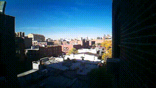

# Timelapse Camera for Raspberry Pi Zero
## Intended to run upon booting the device, no GUI/interaction

APT INSTALLS on RASPBERRY PI
1. picamera2 
2. ffmpeg

** Need a camera installed! **

Takes 3 args when you run it:
`python timelapse_3.py 600 10 False`

those are the defaults as well. Feel free to run as `python timelapse_3.py`
- 600 = duration in seconds 
- - 10 = interval between photos in seconds
False/True = to be processed by ffmpeg into a video. False is a good option for pi Zero because it's too much processing and the machine spins out.

1. Set up a crontab -e to run task @reboot for example
2. Note, `killall python` if you ssh in to your device and want to stop the script from running.
3. Schedule a one time job with at.

